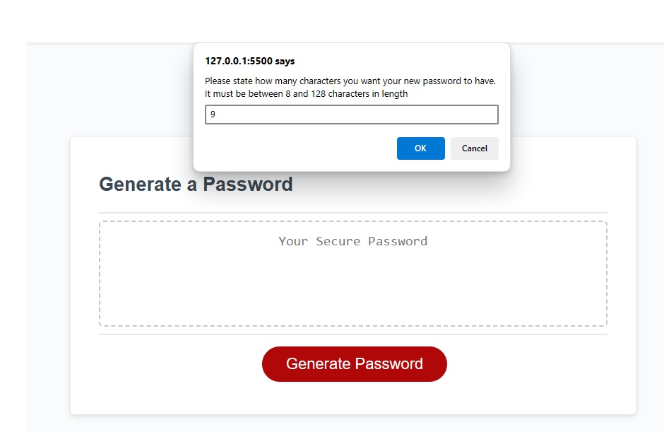
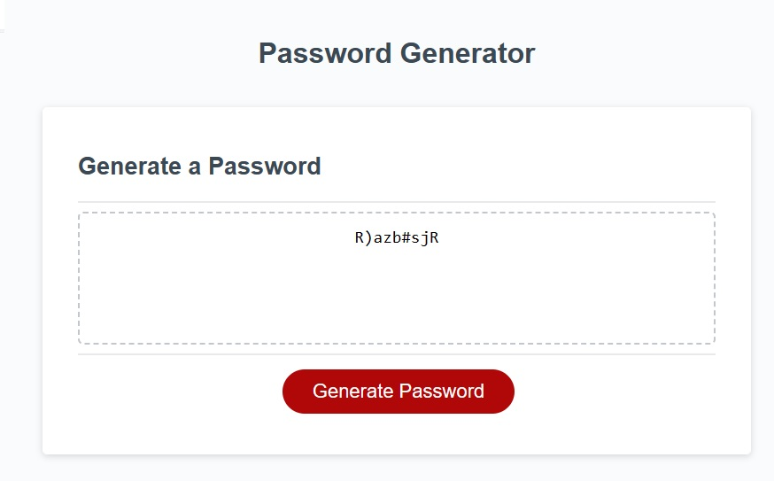

Javascript Password Generator
Table of Contents
Description
Badges
Visuals
Installation
Usage
Support
Contributing
Authors and acknowledgment
License
1. Description
This contains code for a random password generator with html and css to run in browser, and operate through Javascript. It provides users with a number of prompts to allow them to selection of desired password length between 8-128 characters, and choices of character types including lowercase and uppercase letters, numbers and special characters. The application randomizes and returns the generated password based on the user prompts and displays this in the text box.

If the user inputs the wrong information in the text prompt boxes, the app will return corresponding error messages and remind the user the correct information to be inputted, according to the criteria.

2. Badges
HTML5 CSS3 JavaScript Edge Firefox Google Chrome IE Opera Safari

3. Visuals
The following images demonstrate the password generator's functioning:

 

4. Installation
The app can be used in browser, using html, css, and Javascript.

5. Usage
This application can be used as a password generator, which will generate a random password between 8-128 characters long, with a user selection of character types. The Javascript file provides comments to identify different parts of code and its function.

The Javascript file contains variables for input types, including alpha-numerical, lowercase, uppercase, and special characters. It uses conditional statements to:

• Remind the user the allowable password length

• Check the correct characters are entered into the text boxes

• Generate prompts to provide user choice of character types

This app uses a for loop to randomize the password, and uses event listeners to provide interactivity.

6. Support
For support, users can contact tydamon@hotmail.com.

8. Contributing
Any contributions you make are greatly appreciated.

If you have a suggestion that would make this better, please fork the repo and create a pull request. You can also simply open an issue with the tag "enhancement".

Fork the Project
Create your Feature Branch (git checkout -b feature/NewFeature)
Commit your Changes (git commit -m 'Add some NewFeature')
Push to the Branch (git push origin feature/NewFeature)
Open a Pull Request
9. Authors and acknowledgment
The author acknowledges and credits those who have contributed to this project, including:

• Provided Code Refactor Starter Code

• https://git.bootcampcontent.com/Monash-University/MONU-VIRT-FSF-PT-11-2023-U-LOLC

• Chee Ho Tai

• Pranita Shrestha

10. License
Distributed under the MIT License. See LICENSE.txt for more information.
